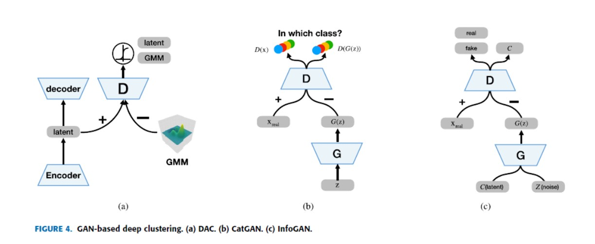

## InfoGAN 信息最大化生成对抗网络

常用于深度聚类的GAN网络有3种：
- 深度对抗性聚类(DAC, Deep Adversarial Clustering)
- 类别生成对抗网络(CatGAN, Categorial Generative Adversarial Network)
- 信息最大化生成对抗网络(InfoGAN, Information Maximizing Generative Adversarial Network)

先讲讲最让人难懂的InfoGAN。信息最大化，首先要明确这个信息应该如何量化，而这则要从信息论讲起。

### 信息熵
$$H(x)=\sum p(x)logp(x)$$
先提一下绕不开的信息熵，不难证明，上式满足这3条性质：
- 单调性，发生概率越高的事件，其携带的信息量越低；
- 非负性，信息熵可以看作为一种广度量，非负性是一种合理的必然；
- 累加性，即多随机事件同时发生存在的总不确定性的量度是可以表示为各事件不确定性的量度的和，这也是广度量的一种体现。

对于信息熵这3条性质的理解，笔者看的是这篇:[信息熵及其相关概念](https://blog.csdn.net/am290333566/article/details/81187124)

### 互信息(Mutual Information)
InfoGAN的思路是最大化GAN的噪声变量子集与观测点间的互信息。
